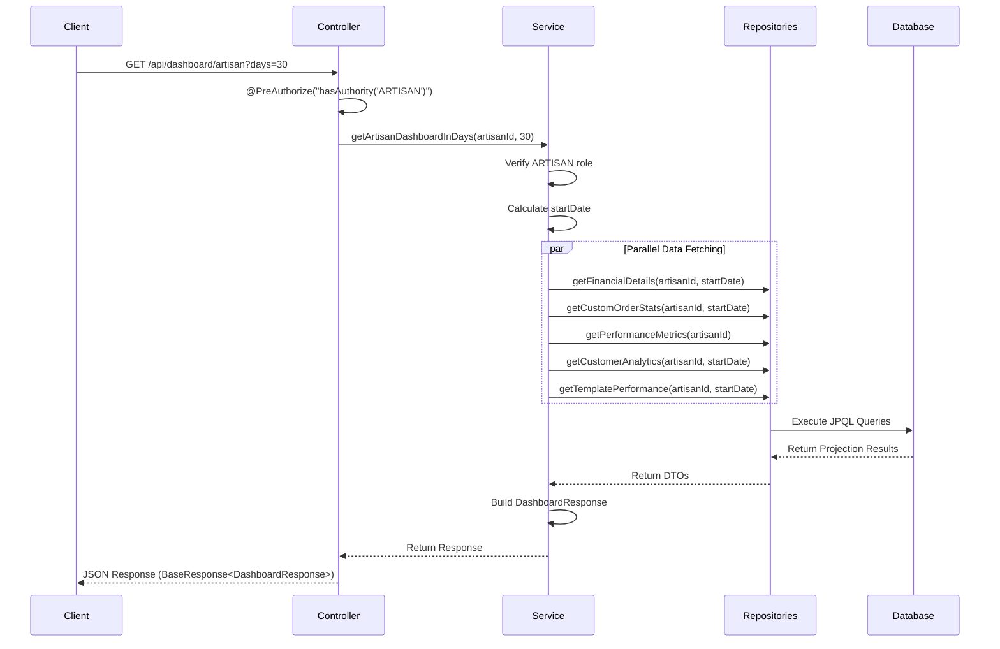

# Tài liệu Thiết kế - Artisan Dashboard Statistics

## Tổng quan

Artisan Dashboard Statistics là một tính năng cung cấp thống kê toàn diện cho artisan về hiệu suất kinh doanh của họ. Hệ thống sử dụng kiến trúc layered với Service layer xử lý business logic, Repository layer với JPQL queries để tổng hợp dữ liệu hiệu quả, và DTO projections để tối ưu hóa performance.

Thiết kế tận dụng cơ sở hạ tầng hiện có từ Admin Dashboard và mở rộng với các metrics đặc thù cho artisan như financial details, custom order statistics, performance metrics, customer analytics và template performance.

## Kiến trúc

### Layered Architecture

```
┌─────────────────────────────────────────┐
│         Controller Layer                │
│  (ArtisanDashboardController)          │
└─────────────────┬───────────────────────┘
                  │
┌─────────────────▼───────────────────────┐
│         Service Layer                   │
│  (DashboardService/Imp)                │
│  - Business Logic                       │
│  - Data Aggregation                     │
│  - Authorization                        │
└─────────────────┬───────────────────────┘
                  │
┌─────────────────▼───────────────────────┐
│       Repository Layer                  │
│  - Custom JPQL Queries                  │
│  - Interface Projections                │
│  - Database Optimization                │
└─────────────────┬───────────────────────┘
                  │
┌─────────────────▼───────────────────────┐
│         Database Layer                  │
│  (PostgreSQL with JPA)                  │
└─────────────────────────────────────────┘
```

### Component Interaction Flow



## Components và Interfaces

### 1. Controller Layer

#### DashboardController
Tạo DashboardController mới hoặc thêm endpoint vào controller hiện có với authorization cho cả ADMIN và ARTISAN.

**Endpoints:**
```java
// Admin Dashboard
GET /api/dashboard/admin
Query Parameters:
  - days: int (default: 30) - Số ngày để tính thống kê
Authorization: hasAuthority('ADMIN')
Response: DashboardResponse (JSON)

// Artisan Dashboard  
GET /api/dashboard/artisan
Query Parameters:
  - days: int (default: 30) - Số ngày để tính thống kê
Authorization: hasAuthority('ARTISAN')
Response: DashboardResponse (JSON)
```

**Controller Implementation:**
```java
@RestController
@RequestMapping("/api/dashboard")
@RequiredArgsConstructor
public class DashboardController {
    private final DashboardService dashboardService;
    private final AccountService accountService;
    
    @GetMapping("/admin")
    @PreAuthorize("hasAuthority('ADMIN')")
    public ResponseEntity<BaseResponse<DashboardResponse>> getAdminDashboard(
            @RequestParam(defaultValue = "30") int days,
            Authentication authentication) {
        UUID adminId = accountService.getCurrentAccountId(authentication);
        DashboardResponse response = dashboardService.getAdminDashboardInDays(adminId, days);
        return ResponseEntity.ok(BaseResponse.success(response));
    }
    
    @GetMapping("/artisan")
    @PreAuthorize("hasAuthority('ARTISAN')")
    public ResponseEntity<BaseResponse<DashboardResponse>> getArtisanDashboard(
            @RequestParam(defaultValue = "30") int days,
            Authentication authentication) {
        UUID artisanId = accountService.getCurrentAccountId(authentication);
        DashboardResponse response = dashboardService.getArtisanDashboardInDays(artisanId, days);
        return ResponseEntity.ok(BaseResponse.success(response));
    }
}
```

### 2. Service Layer

#### DashboardService Interface
Mở rộng interface hiện có với các methods mới:

```java
// Financial Details
ArtisanFinancialDetails getArtisanFinancialDetails(UUID artisanId, LocalDateTime startDate);
List<WalletBalanceTrend> getWalletBalanceTrend(UUID artisanId, LocalDateTime startDate);

// Custom Order Statistics  
ArtisanCustomOrderStats getArtisanCustomOrderStats(UUID artisanId, LocalDateTime startDate);

// Performance Metrics
ArtisanPerformanceMetrics getArtisanPerformanceMetrics(UUID artisanId, LocalDateTime startDate);

// Customer Analytics
ArtisanCustomerAnalytics getArtisanCustomerAnalytics(UUID artisanId, LocalDateTime startDate);
List<TopCustomerDTO> getArtisanTopCustomers(UUID artisanId);

// Template Performance
ArtisanTemplatePerformance getArtisanTemplatePerformance(UUID artisanId, LocalDateTime startDate);
List<TopTemplateDTO> getArtisanTopTemplates(UUID artisanId);

// Main Dashboard Method
ArtisanDashboardResponse getArtisanDashboardInDays(UUID artisanId, int days);
```

#### DashboardServiceImp
Implement các methods mới trong class hiện có.

**Key Responsibilities:**
- Xác thực ARTISAN role
- Tính toán startDate từ days parameter
- Gọi repository methods để lấy dữ liệu
- Tổng hợp kết quả vào response object
- Xử lý edge cases (null values, zero denominators)

### 3. Repository Layer

#### WalletTransactionRepository
```java
@Query("SELECT " +
       "COALESCE(SUM(CASE WHEN wt.type IN ('PAYMENT_RECEIVED', 'STAGE_PAYMENT_RECEIVED') " +
       "THEN wt.amount ELSE 0 END), 0) as grossEarnings, " +
       "COALESCE(SUM(wt.commissionFee), 0) as totalCommission " +
       "FROM WalletTransaction wt " +
       "WHERE wt.wallet.account.artisan.artisanUuid = :artisanId " +
       "AND wt.createdAt >= :startDate")
ArtisanFinancialSummary getFinancialSummary(@Param("artisanId") UUID artisanId, 
                                            @Param("startDate") LocalDateTime startDate);

@Query("SELECT DATE(wt.createdAt) as date, " +
       "SUM(wt.balanceAfter) as balance " +
       "FROM WalletTransaction wt " +
       "WHERE wt.wallet.account.artisan.artisanUuid = :artisanId " +
       "AND wt.createdAt >= :startDate " +
       "GROUP BY DATE(wt.createdAt) " +
       "ORDER BY date")
List<WalletBalanceTrend> getWalletBalanceTrend(@Param("artisanId") UUID artisanId,
                                                @Param("startDate") LocalDateTime startDate);
```

#### WithdrawalRequestRepository
```java
@Query("SELECT COALESCE(SUM(wr.amount), 0) " +
       "FROM WithdrawalRequest wr " +
       "WHERE wr.artisan.artisanUuid = :artisanId " +
       "AND wr.status = 'PENDING'")
BigDecimal getPendingWithdrawalAmount(@Param("artisanId") UUID artisanId);
```

#### CustomRequestRepository
```java
@Query("SELECT " +
       "COUNT(cr) as totalRequests, " +
       "COUNT(cr.customOrder) as totalOrders, " +
       "COALESCE(AVG(co.totalPrice), 0) as avgOrderValue, " +
       "CASE WHEN COUNT(cr) > 0 THEN (COUNT(cr.customOrder) * 100.0 / COUNT(cr)) ELSE NULL END as conversionRate " +
       "FROM CustomRequest cr " +
       "LEFT JOIN cr.customOrder co " +
       "WHERE cr.selectedArtisan.artisanUuid = :artisanId " +
       "AND cr.createdAt >= :startDate")
ArtisanCustomOrderStats getCustomOrderStats(@Param("artisanId") UUID artisanId,
                                            @Param("startDate") LocalDateTime startDate);

@Query("SELECT COUNT(cr) " +
       "FROM CustomRequest cr " +
       "WHERE cr.selectedArtisan.artisanUuid = :artisanId " +
       "AND cr.status IN ('PENDING', 'QUOTED')")
Long getPendingRequestsCount(@Param("artisanId") UUID artisanId);
```

#### CustomOrderRepository
```java
@Query("SELECT AVG(DATEDIFF(co.completedAt, co.createdAt)) " +
       "FROM CustomOrder co " +
       "WHERE co.artisan.artisanUuid = :artisanId " +
       "AND co.status = 'COMPLETED' " +
       "AND co.completedAt IS NOT NULL " +
       "AND co.createdAt >= :startDate")
Double getAvgCompletionTimeDays(@Param("artisanId") UUID artisanId,
                                @Param("startDate") LocalDateTime startDate);
```

#### FeedbackRepository
```java
@Query("SELECT " +
       "COALESCE(AVG(f.rating), NULL) as avgRating, " +
       "COUNT(f) as totalReviews " +
       "FROM Feedback f " +
       "WHERE f.artisan.artisanUuid = :artisanId")
ArtisanRatingStats getRatingStats(@Param("artisanId") UUID artisanId);
```

#### ConversationRepository (New)
```java
@Query("SELECT AVG(TIMESTAMPDIFF(HOUR, cr.createdAt, " +
       "(SELECT MIN(cm.createdAt) FROM ChatMessage cm " +
       "WHERE cm.conversation.conversationId = c.conversationId " +
       "AND cm.sender.artisan.artisanUuid = :artisanId))) " +
       "FROM CustomRequest cr " +
       "JOIN cr.conversation c " +
       "WHERE cr.selectedArtisan.artisanUuid = :artisanId " +
       "AND EXISTS (SELECT 1 FROM ChatMessage cm2 " +
       "WHERE cm2.conversation.conversationId = c.conversationId " +
       "AND cm2.sender.artisan.artisanUuid = :artisanId)")
Double getAvgResponseTimeHours(@Param("artisanId") UUID artisanId);
```

#### OrderRepository
```java
@Query("SELECT " +
       "(COUNT(CASE WHEN o.status = 'DELIVERED' THEN 1 END) * 100.0 / " +
       "NULLIF(COUNT(CASE WHEN o.status != 'CANCELLED' THEN 1 END), 0)) as fulfillmentRate " +
       "FROM Order o " +
       "JOIN o.orderDetails od " +
       "WHERE od.product.artisan.artisanUuid = :artisanId")
Double getOrderFulfillmentRate(@Param("artisanId") UUID artisanId);

@Query("SELECT " +
       "(COUNT(CASE WHEN o.actualDeliveryDate <= o.expectedDeliveryDate THEN 1 END) * 100.0 / " +
       "NULLIF(COUNT(CASE WHEN o.status = 'DELIVERED' THEN 1 END), 0)) as onTimeRate " +
       "FROM Order o " +
       "JOIN o.orderDetails od " +
       "WHERE od.product.artisan.artisanUuid = :artisanId " +
       "AND o.status = 'DELIVERED'")
Double getOnTimeDeliveryRate(@Param("artisanId") UUID artisanId);
```

#### ComplaintRepository
```java
@Query("SELECT " +
       "(COUNT(c) * 100.0 / NULLIF(:totalOrders, 0)) as complaintRate " +
       "FROM Complaint c " +
       "WHERE (c.order.id IN " +
       "(SELECT o.orderId FROM Order o JOIN o.orderDetails od " +
       "WHERE od.product.artisan.artisanUuid = :artisanId) " +
       "OR c.customOrder.artisan.artisanUuid = :artisanId)")
Double getComplaintRate(@Param("artisanId") UUID artisanId, 
                       @Param("totalOrders") Long totalOrders);
```

#### AccountRepository
```java
@Query("SELECT DISTINCT a.accountId as customerId, " +
       "a.fullName as customerName, " +
       "a.email as email, " +
       "COUNT(DISTINCT o.orderId) + COUNT(DISTINCT co.customOrderId) as totalOrders, " +
       "COALESCE(SUM(o.totalPrice), 0) + COALESCE(SUM(co.totalPrice), 0) as totalSpent " +
       "FROM Account a " +
       "LEFT JOIN Order o ON o.customer.accountId = a.accountId " +
       "LEFT JOIN o.orderDetails od ON od.order.orderId = o.orderId " +
       "LEFT JOIN CustomOrder co ON co.customer.accountId = a.accountId " +
       "WHERE (od.product.artisan.artisanUuid = :artisanId " +
       "OR co.artisan.artisanUuid = :artisanId) " +
       "AND (o.createdAt >= :startDate OR co.createdAt >= :startDate) " +
       "GROUP BY a.accountId, a.fullName, a.email " +
       "ORDER BY totalSpent DESC")
List<TopCustomerDTO> getArtisanTopCustomers(@Param("artisanId") UUID artisanId,
                                            @Param("startDate") LocalDateTime startDate,
                                            Pageable pageable);

@Query("SELECT " +
       "COUNT(DISTINCT a.accountId) as totalCustomers, " +
       "(COUNT(DISTINCT CASE WHEN orderCount > 1 THEN a.accountId END) * 100.0 / " +
       "NULLIF(COUNT(DISTINCT a.accountId), 0)) as repeatRate " +
       "FROM Account a " +
       "JOIN (SELECT o.customer.accountId as custId, COUNT(o) as orderCount " +
       "FROM Order o JOIN o.orderDetails od " +
       "WHERE od.product.artisan.artisanUuid = :artisanId " +
       "AND o.createdAt >= :startDate " +
       "GROUP BY o.customer.accountId) subq " +
       "ON a.accountId = subq.custId")
ArtisanCustomerStats getCustomerStats(@Param("artisanId") UUID artisanId,
                                      @Param("startDate") LocalDateTime startDate);
```

#### ProductTemplateRepository (New)
```java
@Query("SELECT COUNT(pt) " +
       "FROM ProductTemplate pt " +
       "WHERE pt.artisan.artisanUuid = :artisanId")
Long getTotalTemplatesCount(@Param("artisanId") UUID artisanId);

@Query("SELECT pt.templateId as templateId, " +
       "pt.name as templateName, " +
       "COUNT(otd) as totalOrders, " +
       "COALESCE(SUM(otd.price * otd.quantity), 0) as totalRevenue " +
       "FROM ProductTemplate pt " +
       "LEFT JOIN OrderTemplateDetail otd ON otd.template.templateId = pt.templateId " +
       "WHERE pt.artisan.artisanUuid = :artisanId " +
       "GROUP BY pt.templateId, pt.name " +
       "ORDER BY totalOrders DESC")
List<TopTemplateDTO> getTopTemplates(@Param("artisanId") UUID artisanId, Pageable pageable);

@Query("SELECT " +
       "(COUNT(DISTINCT CASE WHEN EXISTS " +
       "(SELECT 1 FROM OrderTemplateDetail otd WHERE otd.template.templateId = pt.templateId) " +
       "THEN pt.templateId END) * 100.0 / NULLIF(COUNT(pt), 0)) as conversionRate " +
       "FROM ProductTemplate pt " +
       "WHERE pt.artisan.artisanUuid = :artisanId")
Double getTemplateConversionRate(@Param("artisanId") UUID artisanId);
```

## Data Models

### DTO Response Classes

#### DashboardResponse (Mở rộng)
Sử dụng DashboardResponse hiện có và mở rộng với các fields mới cho artisan:

```java
@Data
@Builder
public class DashboardResponse {
    // Existing fields (dùng chung cho cả Admin và Artisan)
    private DashboardSummary summary;
    private List<DailyRevenue> revenueChart;
    private Map<OrderStatus, Integer> orderStatus;
    private List<TopProductDTO> topProducts;
    private List<ShortStockProduct> lowStockProducts;
    
    // Admin-specific fields (chỉ có khi role = ADMIN)
    private CustomerStatistics customerStats;
    private ArtisanStatistics artisanStats;
    private CustomOrderStatistics customOrderStats;
    private ComplaintStatistics complaintStats;
    private RevenueBreakdown revenueBreakdown;
    private ProductAnalytics productAnalytics;
    private List<TopCustomerDTO> topCustomers;
    private List<TopArtisanDTO> topArtisans;
    
    // Artisan-specific fields (chỉ có khi role = ARTISAN)
    private ArtisanFinancialDetails financialDetails;
    private ArtisanCustomOrderStats artisanCustomOrderStats;
    private ArtisanPerformanceMetrics performanceMetrics;
    private ArtisanCustomerAnalytics customerAnalytics;
    private ArtisanTemplatePerformance templatePerformance;
    private List<TopCustomerDTO> artisanTopCustomers;
    private List<TopTemplateDTO> topTemplates;
}
```

#### ArtisanFinancialDetails
```java
public interface ArtisanFinancialDetails {
    BigDecimal getGrossEarnings();
    BigDecimal getTotalCommission();
    BigDecimal getNetEarnings(); // Calculated: gross - commission
    BigDecimal getPendingWithdrawal();
    BigDecimal getCurrentBalance();
}
```

#### WalletBalanceTrend
```java
public interface WalletBalanceTrend {
    LocalDate getDate();
    BigDecimal getBalance();
}
```

#### ArtisanCustomOrderStats
```java
public interface ArtisanCustomOrderStats {
    Long getTotalRequests();
    Long getTotalOrders();
    BigDecimal getAvgOrderValue();
    Double getConversionRate(); // Percentage
    Long getPendingRequests();
    Double getAvgCompletionDays();
}
```

#### ArtisanPerformanceMetrics
```java
public interface ArtisanPerformanceMetrics {
    Double getAvgRating(); // 1-5 scale
    Long getTotalReviews();
    Double getAvgResponseTimeHours();
    Double getOrderFulfillmentRate(); // Percentage
    Double getComplaintRate(); // Percentage
    Double getOnTimeDeliveryRate(); // Percentage
}
```

#### ArtisanCustomerAnalytics
```java
public interface ArtisanCustomerAnalytics {
    Long getTotalCustomers();
    Double getRepeatCustomerRate(); // Percentage
    Double getCustomerSatisfactionScore(); // Percentage (avgRating/5*100)
}
```

#### TopCustomerDTO
```java
public interface TopCustomerDTO {
    UUID getCustomerId();
    String getCustomerName();
    String getEmail();
    Long getTotalOrders();
    BigDecimal getTotalSpent();
}
```

#### ArtisanTemplatePerformance
```java
public interface ArtisanTemplatePerformance {
    Long getTotalTemplates();
    Double getTemplateConversionRate(); // Percentage
}
```

#### TopTemplateDTO
```java
public interface TopTemplateDTO {
    UUID getTemplateId();
    String getTemplateName();
    Long getTotalOrders();
    BigDecimal getTotalRevenue();
}
```

### Implementation Classes

Một số metrics cần implementation class để kết hợp dữ liệu từ nhiều queries:

```java
private static class ArtisanFinancialDetailsImpl implements ArtisanFinancialDetails {
    private final BigDecimal grossEarnings;
    private final BigDecimal totalCommission;
    private final BigDecimal pendingWithdrawal;
    private final BigDecimal currentBalance;
    
    // Constructor, getters
    
    @Override
    public BigDecimal getNetEarnings() {
        return grossEarnings.subtract(totalCommission);
    }
}
```

## Error Handling

### Authorization Errors
```java
if (!account.getRole().getName().equals("ARTISAN")) {
    throw new UnauthorizedException("Bạn không có quyền truy cập");
}
```

### Null Handling
- Sử dụng `COALESCE` trong JPQL queries để xử lý null values
- Trả về `null` cho percentage metrics khi denominator = 0
- Trả về empty lists thay vì null cho collection results

### Edge Cases
1. **Artisan chưa có giao dịch**: Trả về zero values
2. **Không có feedback**: avgRating = null, totalReviews = 0
3. **Không có custom requests**: Tất cả custom order stats = 0 hoặc null
4. **Không có templates**: totalTemplates = 0, empty lists
5. **Division by zero**: Trả về null thay vì throw exception

## Testing Strategy

### Unit Tests

#### Service Layer Tests
```java
@Test
void getArtisanFinancialDetails_WithTransactions_ReturnsCorrectCalculations() {
    // Given: Mock wallet transactions with known values
    // When: Call getArtisanFinancialDetails
    // Then: Verify gross, commission, net calculations
}

@Test
void getArtisanFinancialDetails_NoTransactions_ReturnsZeroValues() {
    // Given: Artisan with no transactions
    // When: Call getArtisanFinancialDetails
    // Then: Verify all values are zero
}

@Test
void getArtisanCustomOrderStats_CalculatesConversionRate() {
    // Given: 10 requests, 3 converted to orders
    // When: Call getArtisanCustomOrderStats
    // Then: Verify conversionRate = 30.0
}

@Test
void getArtisanPerformanceMetrics_NoFeedback_ReturnsNullRating() {
    // Given: Artisan with no feedback
    // When: Call getArtisanPerformanceMetrics
    // Then: Verify avgRating is null, totalReviews is 0
}
```

#### Repository Tests
```java
@DataJpaTest
class WalletTransactionRepositoryTest {
    @Test
    void getFinancialSummary_AggregatesCorrectly() {
        // Given: Sample wallet transactions
        // When: Call getFinancialSummary
        // Then: Verify aggregation results
    }
}
```

### Integration Tests

```java
@SpringBootTest
@AutoConfigureMockMvc
class ArtisanDashboardIntegrationTest {
    @Test
    @WithMockUser(roles = "ARTISAN")
    void getArtisanDashboard_ReturnsCompleteData() {
        // Given: Artisan with complete data
        // When: GET /api/dashboard/artisan?days=30
        // Then: Verify response contains all artisan sections
    }
    
    @Test
    @WithMockUser(roles = "CUSTOMER")
    void getArtisanDashboard_NonArtisan_Returns403() {
        // Given: User with CUSTOMER role
        // When: GET /api/dashboard/artisan
        // Then: Verify 403 Forbidden
    }
    
    @Test
    @WithMockUser(roles = "ADMIN")
    void getAdminDashboard_ReturnsCompleteData() {
        // Given: Admin with complete data
        // When: GET /api/dashboard/admin?days=30
        // Then: Verify response contains all admin sections
    }
}
```

## Performance Considerations

### Query Optimization
1. **Index Strategy**: Đảm bảo indexes trên:
   - `wallet_transactions(wallet_id, created_at, commission_fee)`
   - `custom_requests(selected_artisan_id, created_at, status)`
   - `feedbacks(artisan_id)`
   - `product_templates(artisan_id)`

2. **Projection Usage**: Sử dụng interface projections thay vì fetch full entities

3. **Parallel Execution**: Các queries độc lập có thể chạy song song (future enhancement)

### Caching Strategy
- Cache SystemConfig (commission rate) trong Redis
- Consider caching dashboard results với TTL 5-10 phút
- Invalidate cache khi có transactions mới

### Response Time Target
- Target: < 5 seconds cho dashboard request
- Optimize bằng cách giới hạn time range (default 30 days)
- Pagination cho top lists (limit 10)

## Security Considerations

1. **Role-Based Access**: Chỉ ARTISAN role mới truy cập được
2. **Data Isolation**: Queries luôn filter theo artisanId
3. **Input Validation**: Validate days parameter (min: 1, max: 365)
4. **SQL Injection Prevention**: Sử dụng parameterized queries (@Param)

## Future Enhancements

1. **Export Reports**: PDF/Excel export functionality
2. **Real-time Updates**: WebSocket cho live dashboard updates
3. **Comparative Analytics**: So sánh với period trước
4. **Predictive Analytics**: ML-based revenue forecasting
5. **Custom Date Ranges**: Cho phép chọn start/end date thay vì chỉ days
6. **Drill-down Details**: Click vào metrics để xem chi tiết
