# Sequence Diagram - Hệ Thống Hoàn Tiền

## Tổng Quan

Document này mô tả chi tiết các luồng hoàn tiền trong hệ thống khiếu nại và hoàn tiền. Bao gồm 4 luồng chính:

1. **Luồng 1**: Hoàn tiền không cần trả hàng
2. **Luồng 2**: Hoàn tiền có trả hàng
3. **Luồng 3**: Admin từ chối khiếu nại
4. **Luồng 4**: Retry refund thất bại

---

## Sequence Diagram Đầy Đủ

```mermaid
sequenceDiagram
    participant C as Customer
    participant A as Artisan
    participant Admin as Admin
    participant CS as ComplaintService
    participant RS as RefundService
    participant WS as WalletService
    participant NS as NotificationService
    participant DB as Database

    Note over C,DB: LUỒNG 1: HOÀN TIỀN KHÔNG CẦN TRẢ HÀNG

    C->>CS: POST /api/complaints<br/>(orderId, reason, evidenceImages)
    CS->>DB: Validate order (DELIVERED, within 7 days)
    CS->>DB: Check no existing complaint
    CS->>DB: Create Complaint (status: PENDING)
    CS->>NS: Notify Artisan
    CS-->>C: 200 OK (complaintId, status: PENDING)

    A->>CS: GET /api/artisan/complaints
    CS-->>A: List of complaints
    
    A->>CS: POST /api/artisan/complaints/{id}/respond<br/>(response, requireReturn: false)
    CS->>DB: Update Complaint (artisanResponse, requireReturn: false)
    CS->>NS: Notify Admin
    CS-->>A: 200 OK (status: PENDING)

    Admin->>CS: GET /api/admin/complaints?status=PENDING
    CS-->>Admin: List of pending complaints
    
    Admin->>CS: POST /api/admin/complaints/{id}/approve<br/>(refundAmount, adminNote)
    CS->>DB: Validate refund amount (≤ 90% of total)
    CS->>DB: Update Complaint (status: PROCESSING_REFUND)
    
    CS->>RS: processRefund(complaint, amount)
    RS->>WS: getOrCreateWallet(artisan)
    RS->>WS: getOrCreateWallet(customer)
    RS->>DB: Find original commission fee
    RS->>DB: Check artisan balance ≥ amount
    
    alt Artisan has sufficient balance
        RS->>DB: Create RefundTransaction (status: PENDING)
        RS->>DB: Create WalletTransaction (REFUND_DEBIT, -amount)
        RS->>DB: Update artisan wallet (balance -= amount)
        RS->>DB: Create WalletTransaction (REFUND_CREDIT, +amount)
        RS->>DB: Update customer wallet (balance += amount)
        RS->>DB: Update RefundTransaction (status: COMPLETED)
        RS-->>CS: RefundTransaction (COMPLETED)
        
        CS->>DB: Update Complaint (status: APPROVED)
        CS->>NS: Notify Customer (REFUND_COMPLETED)
        CS->>NS: Notify Artisan (COMPLAINT_APPROVED)
        CS-->>Admin: 200 OK (status: APPROVED)
    else Insufficient balance
        RS->>DB: Create RefundTransaction (status: FAILED, failureReason)
        RS->>NS: Notify Admin (REFUND_FAILED)
        RS-->>CS: throw InsufficientBalanceException
        CS->>DB: Revert Complaint (status: PENDING)
        CS->>NS: Notify Admin (REFUND_FAILED)
        CS-->>Admin: 400 Error (Insufficient balance)
    end

    Note over C,DB: LUỒNG 2: HOÀN TIỀN CÓ TRẢ HÀNG

    C->>CS: POST /api/complaints<br/>(orderId, reason, evidenceImages)
    CS->>DB: Create Complaint (status: PENDING)
    CS->>NS: Notify Artisan
    CS-->>C: 200 OK

    A->>CS: POST /api/artisan/complaints/{id}/respond<br/>(response, requireReturn: true)
    CS->>DB: Update Complaint (requireReturn: true)
    CS->>NS: Notify Admin
    CS-->>A: 200 OK

    Admin->>CS: POST /api/admin/complaints/{id}/approve<br/>(refundAmount, adminNote)
    CS->>DB: Update Complaint (status: WAITING_RETURN)
    CS->>NS: Notify Customer (return instructions)
    CS-->>Admin: 200 OK (status: WAITING_RETURN)

    C->>CS: POST /api/complaints/{id}/return<br/>(shipment details)
    CS->>DB: Create Return Shipment
    CS-->>C: 200 OK (trackingNumber)

    A->>CS: POST /api/artisan/return-shipments/{id}/confirm
    CS->>DB: Update Shipment (status: DELIVERED)
    CS->>DB: Update Complaint (status: PROCESSING_REFUND)
    
    CS->>RS: processRefund(complaint, amount)
    Note over RS,DB: Same refund process as Luồng 1
    RS-->>CS: RefundTransaction (COMPLETED)
    
    CS->>DB: Update Complaint (status: APPROVED)
    CS->>NS: Notify Customer & Artisan
    CS-->>A: 200 OK

    Note over C,DB: LUỒNG 3: ADMIN TỪ CHỐI KHIẾU NẠI

    C->>CS: POST /api/complaints
    CS->>DB: Create Complaint (status: PENDING)
    CS-->>C: 200 OK

    A->>CS: POST /api/artisan/complaints/{id}/respond
    CS->>DB: Update Complaint
    CS-->>A: 200 OK

    Admin->>CS: POST /api/admin/complaints/{id}/reject<br/>(rejectionReason)
    CS->>DB: Update Complaint (status: REJECTED, rejectionReason)
    CS->>NS: Notify Customer (COMPLAINT_REJECTED)
    CS-->>Admin: 200 OK (status: REJECTED)

    Note over C,DB: LUỒNG 4: RETRY REFUND THẤT BẠI

    Admin->>RS: GET /api/admin/complaints/refund-transactions?status=FAILED
    RS->>DB: Find failed transactions
    RS-->>Admin: List of failed refunds

    Admin->>RS: POST /api/admin/complaints/refund-transactions/{id}/retry
    RS->>DB: Validate transaction (status: FAILED)
    RS->>DB: Get complaint and amount from failed transaction
    
    RS->>RS: processRefund(complaint, amount)
    Note over RS,DB: Retry same refund process
    
    alt Retry successful
        RS->>DB: Create new RefundTransaction (COMPLETED)
        RS-->>Admin: 200 OK (new transaction)
    else Still insufficient
        RS->>DB: Create new RefundTransaction (FAILED)
        RS-->>Admin: 400 Error
    end
```



---

## Chi Tiết Các Luồng

### Luồng 1: Hoàn Tiền Không Cần Trả Hàng

**Mô tả**: Khách hàng tạo khiếu nại, nghệ nhân đồng ý hoàn tiền mà không yêu cầu trả hàng, admin phê duyệt và hệ thống xử lý hoàn tiền ngay lập tức.

**Các bước chính**:
1. Customer tạo complaint với lý do và hình ảnh bằng chứng
2. Artisan xem và phản hồi (requireReturn = false)
3. Admin xem xét và phê duyệt với số tiền hoàn
4. RefundService xử lý hoàn tiền:
   - Kiểm tra số dư ví nghệ nhân
   - Tạo RefundTransaction
   - Tạo WalletTransaction DEBIT cho nghệ nhân (trừ tiền)
   - Tạo WalletTransaction CREDIT cho khách hàng (cộng tiền)
   - Cập nhật số dư ví
   - Hoàn lại commission fee cho nghệ nhân
5. Gửi thông báo cho các bên liên quan

**Trạng thái Complaint**: PENDING → PROCESSING_REFUND → APPROVED

**Trạng thái RefundTransaction**: PENDING → COMPLETED (hoặc FAILED nếu không đủ tiền)

---

### Luồng 2: Hoàn Tiền Có Trả Hàng

**Mô tả**: Tương tự luồng 1 nhưng nghệ nhân yêu cầu khách hàng trả hàng trước khi hoàn tiền.

**Các bước chính**:
1. Customer tạo complaint
2. Artisan phản hồi (requireReturn = true)
3. Admin phê duyệt nhưng yêu cầu trả hàng
4. Customer tạo return shipment qua GHN
5. Artisan xác nhận đã nhận hàng trả về
6. Hệ thống mới xử lý hoàn tiền (giống luồng 1)

**Trạng thái Complaint**: PENDING → WAITING_RETURN → PROCESSING_REFUND → APPROVED

**Điểm khác biệt**: Có thêm bước tạo và xác nhận return shipment trước khi hoàn tiền

---

### Luồng 3: Admin Từ Chối Khiếu Nại

**Mô tả**: Admin xem xét và quyết định từ chối khiếu nại, không có hoàn tiền.

**Các bước chính**:
1. Customer tạo complaint
2. Artisan phản hồi
3. Admin từ chối với lý do cụ thể
4. Gửi thông báo cho customer

**Trạng thái Complaint**: PENDING → REJECTED

**Lưu ý**: Không có RefundTransaction được tạo

---

### Luồng 4: Retry Refund Thất Bại

**Mô tả**: Khi hoàn tiền thất bại do nghệ nhân không đủ tiền, admin có thể retry sau khi nghệ nhân nạp thêm tiền.

**Các bước chính**:
1. Admin xem danh sách refund transactions thất bại
2. Admin chọn transaction cần retry
3. Hệ thống gọi lại processRefund với cùng complaint và amount
4. Nếu thành công, tạo RefundTransaction mới với status COMPLETED
5. Nếu vẫn thất bại, tạo RefundTransaction mới với status FAILED

**Lưu ý**: 
- Transaction cũ vẫn giữ nguyên status FAILED
- Transaction mới được tạo với ID mới
- Chỉ Admin mới có quyền retry

---

## Các Thành Phần Chính

### Services

1. **ComplaintService**: Quản lý vòng đời của complaint
   - createComplaint()
   - respondToComplaint()
   - approveComplaint()
   - rejectComplaint()

2. **RefundService**: Xử lý logic hoàn tiền
   - processRefund()
   - retryRefund()
   - getRefundTransaction()

3. **WalletService**: Quản lý ví điện tử
   - getOrCreateWallet()
   - updateBalance()

4. **NotificationService**: Gửi thông báo
   - sendNotification()

### Models

1. **Complaint**: Thông tin khiếu nại
   - status: PENDING, WAITING_RETURN, PROCESSING_REFUND, APPROVED, REJECTED
   - requireReturn: boolean
   - refundAmount: BigDecimal

2. **RefundTransaction**: Giao dịch hoàn tiền
   - status: PENDING, COMPLETED, FAILED
   - amount: BigDecimal
   - fromWallet: Wallet (Artisan)
   - toWallet: Wallet (Customer)
   - debitTransaction: WalletTransaction
   - creditTransaction: WalletTransaction

3. **WalletTransaction**: Giao dịch ví
   - type: REFUND_DEBIT, REFUND_CREDIT
   - amount: BigDecimal (âm cho debit, dương cho credit)
   - commissionFee: BigDecimal (âm khi hoàn lại commission)

---

## Xử Lý Commission Fee

Khi hoàn tiền, hệ thống tự động:

1. Tìm commission fee từ giao dịch thanh toán gốc
2. Hoàn lại commission fee cho nghệ nhân (commissionFee âm trong debit transaction)
3. Khách hàng nhận lại TOÀN BỘ số tiền đã trả (bao gồm cả commission)

**Ví dụ**:
- Khách hàng trả: 1,000,000 VND
- Nghệ nhân nhận: 900,000 VND (sau trừ 10% commission = 100,000 VND)
- Khi hoàn tiền 1,000,000 VND:
  - Nghệ nhân bị trừ: 900,000 VND
  - Nghệ nhân được hoàn commission: 100,000 VND
  - Tổng nghệ nhân mất: 1,000,000 VND
  - Khách hàng nhận: 1,000,000 VND

---

## Error Handling

### InsufficientBalanceException

Xảy ra khi ví nghệ nhân không đủ tiền để hoàn.

**Xử lý**:
1. Tạo RefundTransaction với status FAILED
2. Lưu failureReason
3. Gửi thông báo cho Admin
4. Revert complaint status về PENDING
5. Admin có thể retry sau

### Validation Errors

1. **Refund amount > 90% of total**: Số tiền hoàn vượt quá giới hạn
2. **Order not DELIVERED**: Chỉ hoàn tiền cho đơn đã giao
3. **Outside 7-day window**: Quá thời hạn khiếu nại
4. **Complaint already exists**: Đã có khiếu nại cho đơn hàng này

---

## API Endpoints

### Customer APIs
- `POST /api/complaints` - Tạo khiếu nại
- `GET /api/complaints` - Xem danh sách khiếu nại
- `GET /api/complaints/{id}` - Xem chi tiết khiếu nại
- `POST /api/complaints/{id}/return` - Tạo đơn trả hàng

### Artisan APIs
- `GET /api/artisan/complaints` - Xem khiếu nại của mình
- `POST /api/artisan/complaints/{id}/respond` - Phản hồi khiếu nại
- `POST /api/artisan/return-shipments/{id}/confirm` - Xác nhận nhận hàng

### Admin APIs
- `GET /api/admin/complaints` - Xem tất cả khiếu nại
- `POST /api/admin/complaints/{id}/approve` - Phê duyệt khiếu nại
- `POST /api/admin/complaints/{id}/reject` - Từ chối khiếu nại
- `GET /api/admin/complaints/refund-transactions` - Xem giao dịch hoàn tiền
- `POST /api/admin/complaints/refund-transactions/{id}/retry` - Retry hoàn tiền thất bại

---

## Database Transactions

Tất cả các thao tác hoàn tiền được thực hiện trong transaction để đảm bảo tính nhất quán:

```java
@Transactional
public RefundTransaction processRefund(Complaint complaint, BigDecimal amount) {
    // All database operations are atomic
    // If any step fails, entire transaction is rolled back
}
```

**Các bước trong transaction**:
1. Get/Create wallets
2. Find commission fee
3. Check balance
4. Create RefundTransaction
5. Create debit WalletTransaction
6. Update artisan wallet
7. Create credit WalletTransaction
8. Update customer wallet
9. Update RefundTransaction status

Nếu bất kỳ bước nào thất bại, toàn bộ transaction sẽ rollback.

---

## Testing

Xem file `REFUND_SYSTEM_API_TEST_GUIDE.md` để biết chi tiết về cách test các luồng này.

**Test cases chính**:
1. Hoàn tiền thành công không trả hàng
2. Hoàn tiền thành công có trả hàng
3. Hoàn tiền thất bại do không đủ tiền
4. Admin từ chối khiếu nại
5. Retry hoàn tiền thành công
6. Kiểm tra phân quyền
7. Kiểm tra validation

---

## Notes

1. **Commission Refund**: Khi hoàn tiền, commission fee được hoàn lại cho nghệ nhân
2. **Wallet Balance**: Luôn kiểm tra số dư trước khi hoàn tiền
3. **Notifications**: Gửi thông báo cho tất cả các bên liên quan sau mỗi action
4. **Audit Trail**: Tất cả transactions được lưu lại để audit
5. **Idempotency**: Mỗi complaint chỉ có thể có 1 RefundTransaction COMPLETED

---

## Tài Liệu Liên Quan

- `REFUND_SYSTEM_API_TEST_GUIDE.md` - Hướng dẫn test API
- `ComplaintServiceImp.java` - Implementation của ComplaintService
- `RefundServiceImp.java` - Implementation của RefundService
- `Complaint.java` - Model của Complaint
- `RefundTransaction.java` - Model của RefundTransaction
